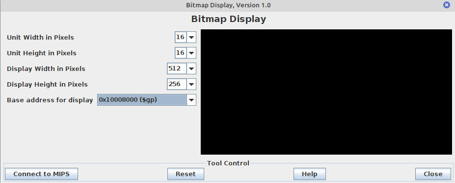

# MIPS Maze Game


**Course:** Computer Systems and Architecture (Ba1 Computer Science)

## Overview

The MIPS Maze Game is a simple maze navigation game implemented in MIPS assembly language. Developed as part of a Computer Systems and Architecture course, this game allows players to navigate through a maze using basic MIPS instructions.

## Features
- **Maze Navigation**: Move a character through a grid-based maze.
- **Basic Controls**: Use keyboard inputs to control movement.
- **Custom Maze Loading**: Load and play custom mazes by editing the `input_1.txt` file.
- **Collision Detection**: Detect collisions with walls.
- **Exit Identification**: Determine when the player reaches the maze's exit.
## Technical Details

- **Language**: MIPS Assembly
- **Simulator**: MARS MIPS Simulator
- **Implementation**: Utilizes basic MIPS instructions for control flow, memory management, and user interaction.


## Installation and Usage

1. **Install Java**: Ensure that Java Runtime Environment (JRE) is installed on your system. MARS is a Java application and requires JRE to run. You can download it from the [official Oracle website](https://www.oracle.com/java/technologies/javase-downloads.html).
2. **Download MARS**: Obtain the MARS simulator from the [MARS website](http://courses.missouristate.edu/kenvollmar/mars/).


3. **Run MARS**: Navigate to the right directory and open the MARS JAR file using Java.
```bash
     java -jar Mars_*.jar
```
   Replace `Mars_*.jar` with the exact name of the JAR file you downloaded.
4. **Load the Project**: Open the `game.asm` file in MARS.
5. **Configure the bitmap**: 
- Go to Tools > Bitmap Display.
- Change the settings exactly as shown below.

- Click 'connect to MIPS' and don't close this window
5. **Assemble and Run**: Assemble the code and run the game to navigate the maze.

## How to play:
Navigate the yellow square to the green square using ZQSD controls. That's it!

## Custom Maze Creation

You can create your own maze by editing the `input_1.txt` file included in the project. The file uses a simple character-based representation to define the maze structure:

- `w`: Represents a wall.
- `p`: Represents a passage where the player can move.
- `s`: Represents the starting position of the player.
- `u`: Represents the exit of the maze.
